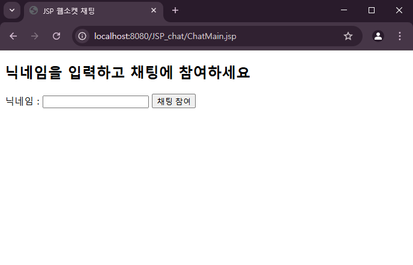
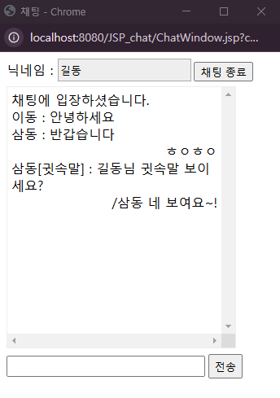

# JSP에서 웹소켓으로  채팅 구현하기

## 1. 실행화면
### 1) 채팅 참여를 위한 메인 화면

### 2) 채팅창 화면 

## 2. 주요 어노테이션
- `@ServerEndPoint` : 웹소켓 서버의 요청명을 설정
    > 예를 들어, `@ServerEndPoint("ChatingServer")` 라고 작성했으면, 이 웹소켓에 접속하기 위한 전체 URL 은 `ws://호스트:포트번호/컨텍스트루트/ChatingServer` 가 되는 것이다.
- `@OnOpen` : 클라이언트가 접속했을 때 요청되는 메서드 정의
- `@OnMessage` : 클라이언트로부터 메시지가 전송되었을 때 실행되는 메서드를 정의
- `@OnClose` : 클라이언트의 접속이 종료되면 실행되는 메서드 정의
- `@OnError` : 에러 발생 시 실행되는 메서드를 정의

## 3. 구현 과정
1) 채팅 서버 구현 ( ..\src\main\java\websocket\ChatServer.jsp)
2) 채팅 클라이언트 구현

    2-1. 채팅 참여 화면 구현 ( ..\webapp\ChatMain.jsp)

    2-2. 서버에 접속하기 위한 요청명을 컨텍스트 초기화 매개변수로 지정 ( ..\webapp\WEB-INF\web.xml)

    2-3. 채팅창 구현 ( ..\webapp\ChatWindow.jsp)
    